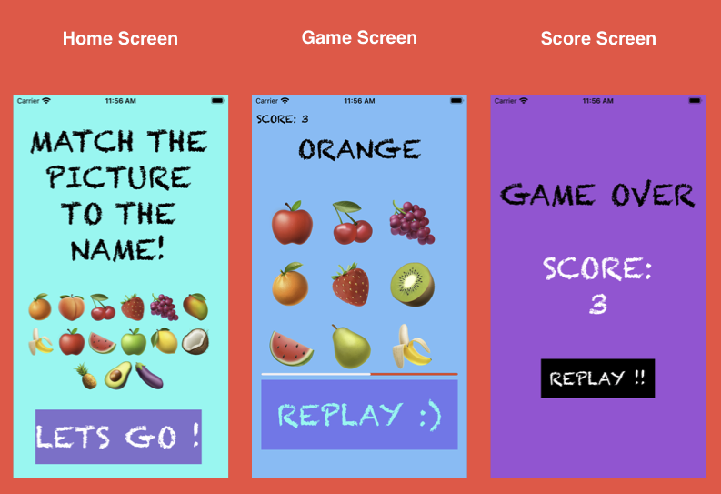

# Fruitness

Fruitness is an educational kids application that lets the user connect the right Image to the correct word. A first of many educational/kids applications to come.

## Introduction
The objective of the game is for the child to match a word with an image. To start the game we have a list of words that are shuffled and displayed accordingly. All of the images should display on the screen, but only one word should display at a time. The user must select the image that corresponds to the word on the screen. If they select the correct image, they are awarded one point, but no points are awarded or deducted if they select an incorrect image. Once the user has made a selection, their score updates and a new word appears. The game ends when each word has been displayed once. At the end of the game, the user sees their score and can start the game again. 

## Game Screens

